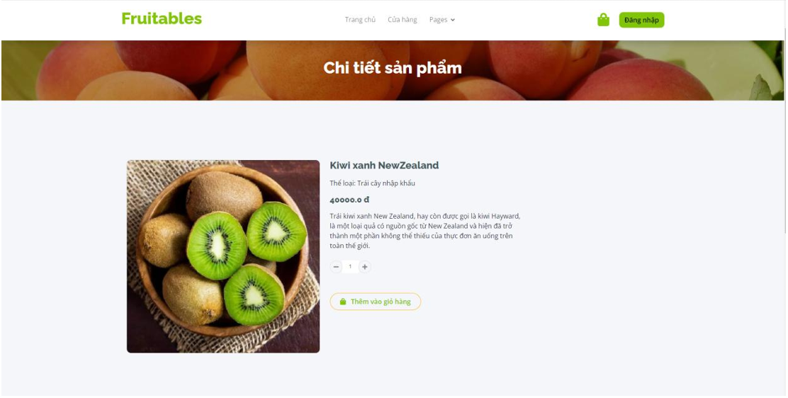
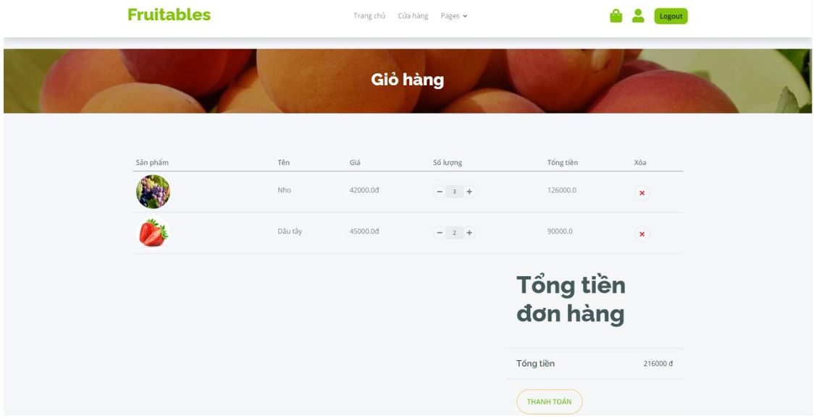
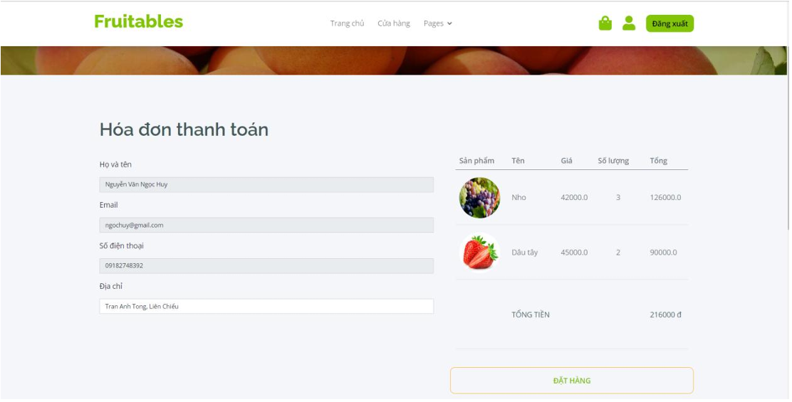
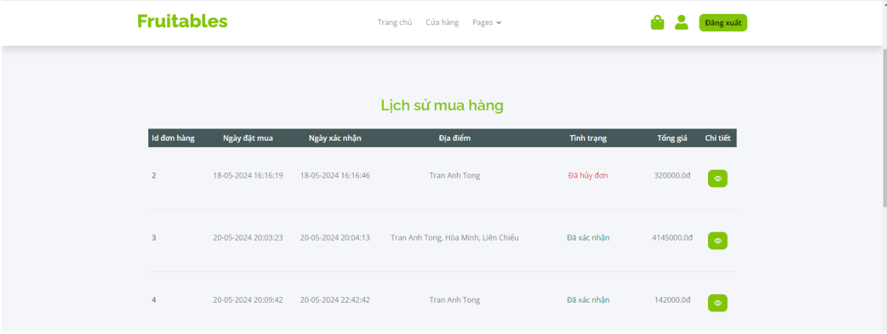
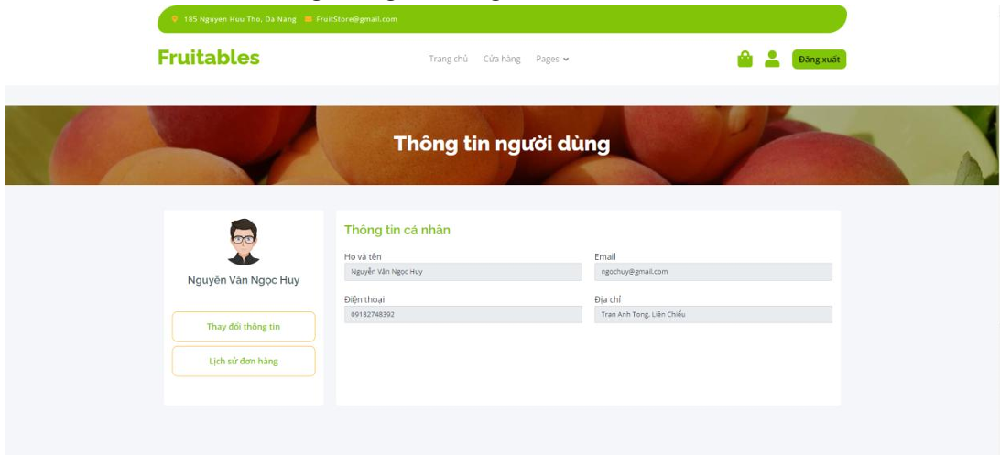
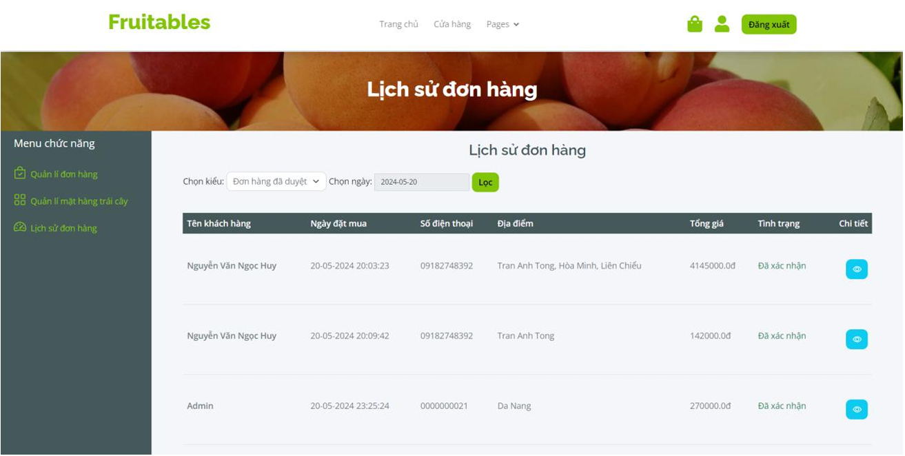
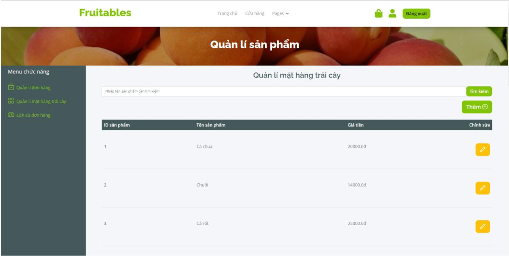
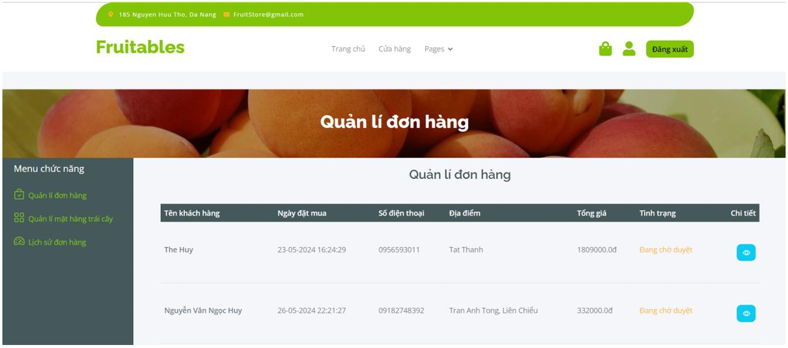

# FruitStore - 6/2024

FruitStore là một dự án web ứng dụng quản lý cửa hàng trái cây, được xây dựng với Java Servlet, JSP, JSTL và sử dụng SQL Server làm cơ sở dữ liệu. Dự án hỗ trợ các chức năng quản lý sản phẩm, đơn hàng, người dùng, phân quyền và xác thực.

## Công nghệ sử dụng
- Java 8
- Servlet API 3.1
- JSP API 2.0
- JSTL 1.2
- Weld Servlet (CDI)
- Microsoft SQL Server (JDBC)
- Maven

## Cấu trúc thư mục
- `src/main/java/Controller/`: Các controller cho admin, auth, user
- `src/main/java/dao/`: DAO interfaces và implement cho các thực thể
- `src/main/java/Model/`: Các model cho Account, Category, Orders, Product, Role, User
- `src/main/java/service/`: Service interfaces và implement
- `src/main/java/utils/`: Các tiện ích như FormUtil, SessionUtil
- `src/main/resources/`: File cấu hình database, message
- `src/main/webapp/`: Giao diện web (JSP, asset, views)
- `database/createData.sql`: Script tạo dữ liệu mẫu cho database

## Chức năng chính
- Quản lý sản phẩm, danh mục
- Quản lý đơn hàng, chi tiết đơn hàng
- Quản lý người dùng, tài khoản, phân quyền
- Đăng nhập, xác thực, lọc quyền truy cập

## Cách build và chạy
1. Cài đặt JDK 8, Maven, SQL Server
2. Tạo database và chạy script `database/createData.sql`
3. Cấu hình kết nối DB trong `src/main/resources/db.properties`
4. Build dự án bằng Maven:
   ```shell
   mvn clean package
   ```
5. Deploy file WAR lên server hỗ trợ Servlet (Tomcat, v.v.)

## Ảnh chụp từ dự án
- Trang chủ
  
- Danh sách sản phẩm
  

- Chi tiết sản phẩm
  

- Giỏ hàng
  

- Hóa đơn
  

- Lịch sử đơn hàng của user
  

- Thông tin cá nhân
  

- Lịch sử đơn hàng của admin
  

- Quản lý mặt hàng
  

- Quản lý đơn hàng
  

